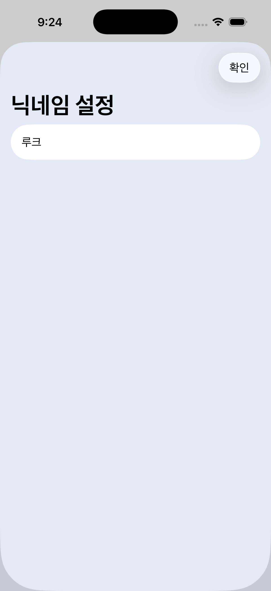
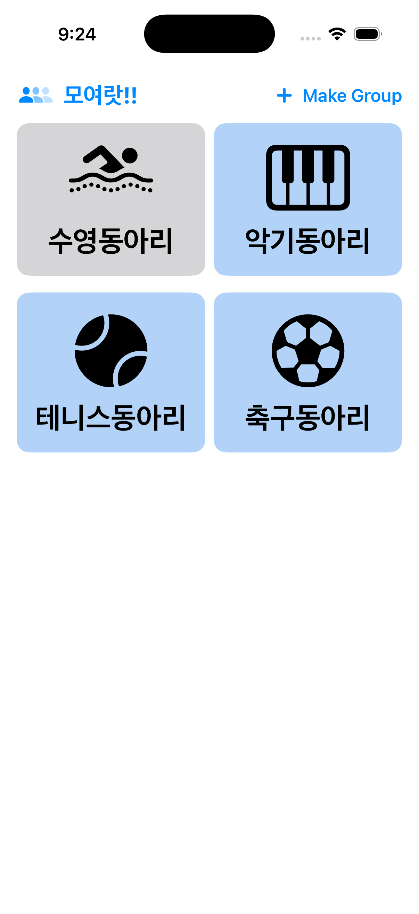
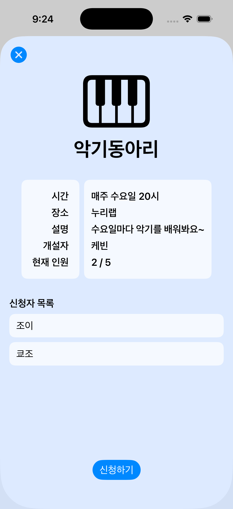
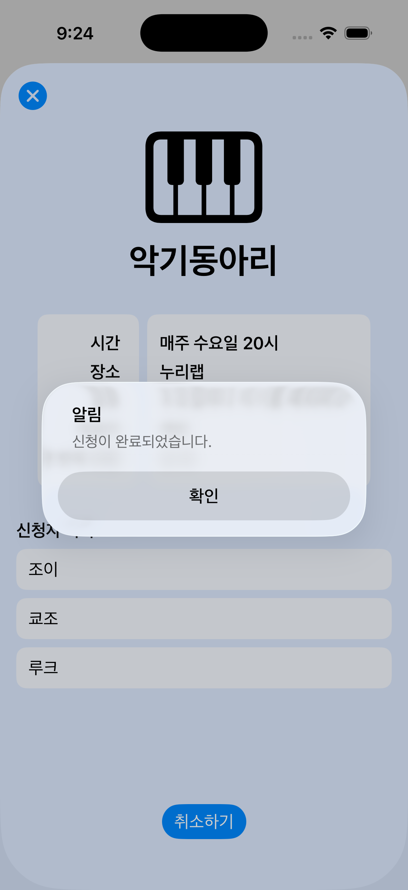
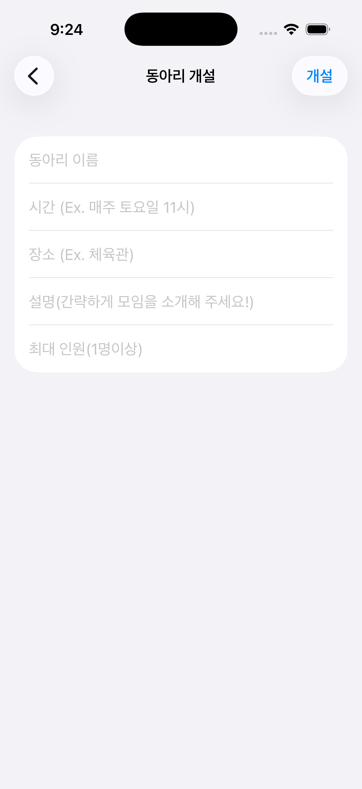

# Academy GroupFinder

아카데미 러너들에게 체계적인 모임 정보를 제공하여, 포항에서도 안정적으로 모임을 찾고 이어갈 수 있도록 돕는 앱입니다.

## 프로젝트 소개

Academy GroupFinder는 아카데미 내에서 모임을 찾고자 하는 러너들이 필요한 정보를 한눈에 확인하고, 자신에게 맞는 모임을 보다 쉽게 발견할 수 있도록 돕기 위해 만든 iOS 앱입니다.  
포항이라는 지역적 환경 속에서도 모임이 일회성으로 끝나지 않고, 지속적이고 안정적으로 이어질 수 있는 기반을 마련하는 것을 목표로 합니다.

## 프로젝트 목적

- 아카데미 내 모임 정보를 직관적으로 제공
- 러너가 자신에게 맞는 모임을 쉽게 탐색할 수 있도록 지원
- 지역적 제약 속에서도 모임이 꾸준히 이어질 수 있는 환경 조성

## 주요 기능

- 사용자 닉네임 입력 및 저장
- 모임 목록 보기
- 모임 상세 정보 확인
- 모임 개설
- 모임 신청 및 취소

## 화면 구성

### 1. 닉네임 설정 화면
- 앱 실행 시 가장 먼저 표시되는 화면입니다.
- 사용자는 닉네임을 입력하고 저장한 뒤 앱을 사용할 수 있습니다.
- 입력한 닉네임은 `@AppStorage`를 통해 로컬에 저장됩니다.

### 2. 메인 화면
- 등록된 모임 목록을 2열 그리드 형태로 확인할 수 있습니다.
- 각 모임은 아이콘, 모임 이름, 모집 가능 여부를 직관적으로 보여줍니다.
- 우측 상단의 `Make Group` 버튼을 통해 새 모임 개설 화면으로 이동할 수 있습니다.

### 3. 모임 상세 화면
- 선택한 모임의 시간, 장소, 설명, 개설자, 현재 인원을 확인할 수 있습니다.
- 신청자 목록을 확인할 수 있습니다.
- 현재 사용자의 상태에 따라 모임 신청 또는 신청 취소가 가능합니다.
- 정원 초과, 개설자 본인 신청 등 예외 상황은 알림으로 안내합니다.

### 4. 모임 개설 화면
- 모임 이름, 시간, 장소, 설명, 최대 인원을 입력해 새 모임을 개설할 수 있습니다.
- 모든 항목 입력 여부와 최대 인원 숫자 유효성을 검사합니다.

## 사용자 흐름

1. 앱 실행
2. 닉네임 입력 및 저장
3. 메인 화면에서 모임 목록 탐색
4. 모임 상세 정보 확인
5. 신청 또는 취소 진행
6. 필요 시 새 모임 개설

## 폴더 구조

```bash
ADA_Challenge1/
├── challenge1/
│   ├── challenge1App.swift          # 앱 진입점
│   ├── ContentView.swift            # 메인 화면
│   ├── NicknameSetupView.swift      # 닉네임 설정 화면
│   ├── ClubDetailView.swift         # 모임 상세 화면
│   ├── AddClubView.swift            # 모임 개설 화면
│   ├── Club.swift                   # 모임 데이터 모델
│   ├── ClubData.swift               # 샘플 모임 데이터
│   ├── Assets.xcassets/             # 앱 아이콘 및 컬러 에셋
│   ├── piano.jpg
│   ├── soccer.jpg
│   └── swim.JPEG
├── challenge1.xcodeproj/            # Xcode 프로젝트 파일
└── readme.md
```

## 데이터 구조

앱은 `Club` 모델을 기반으로 모임 정보를 관리합니다.

- `clubName`: 모임 이름
- `clubTime`: 모임 시간
- `clubPlace`: 모임 장소
- `clubDescription`: 모임 설명
- `clubOwner`: 모임 개설자
- `maxMembers`: 최대 모집 인원
- `members`: 신청자 목록
- `imageName`: 모임 아이콘명

## 구현 포인트

- `NavigationStack`을 사용해 화면 이동을 구성했습니다.
- `sheet`를 활용해 닉네임 설정 및 모임 상세 화면을 표시합니다.
- `@State`, `@Binding`, `@AppStorage`를 사용해 화면 상태와 사용자 정보를 관리합니다.
- 정원 초과 여부에 따라 메인 화면 카드 색상을 다르게 표시해 모집 상태를 직관적으로 전달합니다.

## 기대 효과

- 러너들이 모임 정보를 빠르게 파악하고 참여 여부를 결정할 수 있습니다.
- 단발성 참여가 아니라 지속적인 커뮤니티 형성에 기여할 수 있습니다.
- 포항에서도 안정적으로 모임을 찾고 이어갈 수 있는 사용자 경험을 제공합니다.

## 개선점

향후에는 사용자 경험과 기능 확장을 중심으로 다음과 같은 개선을 진행할 예정이다.

- 닉네임 설정 화면, 모임 상세 화면, 모임 개설 화면의 UX/UI를 전반적으로 리디자인
- 닉네임과 개설된 모임 정보가 앱 종료 후에도 유지될 수 있도록 영구 저장 기능 추가
- 모임 개설 시 이미지 첨부 기능을 도입하고, 홈 화면에서 모임 대표 이미지를 확인할 수 있도록 개선

## 사용 기술

- Swift
- SwiftUI
- Xcode

## 스크린샷

| | | | | |
|---|---|---|---|---|
|  |  |  |  |  |

---

# Academy GroupFinder

An app that provides academy learners with organized group information, helping them find and continue groups more steadily in Pohang.

## Project Overview

Academy GroupFinder is an iOS app designed to help learners within the academy quickly check the information they need at a glance and discover groups that fit them more easily.  
Its goal is to create a foundation where groups do not end as one-time events, but can continue in a stable and sustainable way even within the regional environment of Pohang.

## Project Goal

- Provide group information within the academy in an intuitive way
- Help learners easily explore and find groups that suit them
- Build an environment where groups can continue consistently despite regional limitations

## Key Features

- Entering and saving a user nickname
- Viewing the group list
- Checking detailed group information
- Creating a new group
- Applying to a group and canceling an application

## Screen Structure

### 1. Nickname Setup Screen
- This is the first screen shown when the app launches.
- Users can start using the app after entering and saving a nickname.
- The entered nickname is stored locally using `@AppStorage`.

### 2. Main Screen
- Users can browse registered groups in a two-column grid layout.
- Each group visually shows its icon, group name, and recruitment availability.
- The `Make Group` button in the top-right corner moves the user to the group creation screen.

### 3. Group Detail Screen
- Users can check the selected group's time, location, description, host, and current member count.
- The applicant list is also available on this screen.
- Depending on the current user's status, they can either apply to the group or cancel their application.
- Exceptional cases such as a full group or the host trying to apply are communicated through alerts.

### 4. Group Creation Screen
- Users can create a new group by entering the group name, time, location, description, and maximum number of members.
- The app validates whether all fields are filled in and whether the maximum member count is valid.

## User Flow

1. Launch the app
2. Enter and save a nickname
3. Browse the group list on the main screen
4. Check detailed group information
5. Apply or cancel
6. Create a new group if needed

## Folder Structure

```bash
ADA_Challenge1/
├── challenge1/
│   ├── challenge1App.swift          # App entry point
│   ├── ContentView.swift            # Main screen
│   ├── NicknameSetupView.swift      # Nickname setup screen
│   ├── ClubDetailView.swift         # Group detail screen
│   ├── AddClubView.swift            # Group creation screen
│   ├── Club.swift                   # Group data model
│   ├── ClubData.swift               # Sample group data
│   ├── Assets.xcassets/             # App icon and color assets
│   ├── piano.jpg
│   ├── soccer.jpg
│   └── swim.JPEG
├── challenge1.xcodeproj/            # Xcode project file
└── readme.md
```

## Data Structure

The app manages group information based on the `Club` model.

- `clubName`: Group name
- `clubTime`: Group schedule
- `clubPlace`: Group location
- `clubDescription`: Group description
- `clubOwner`: Group host
- `maxMembers`: Maximum number of members
- `members`: Applicant list
- `imageName`: Group icon name

## Implementation Points

- `NavigationStack` is used to build screen navigation.
- `sheet` is used to present the nickname setup and group detail screens.
- `@State`, `@Binding`, and `@AppStorage` are used to manage UI state and user information.
- The main screen card color changes depending on whether the group is full, making recruitment status easy to understand.

## Expected Effects

- Learners can quickly understand group information and decide whether to participate.
- The app can contribute to building an ongoing community rather than one-time participation.
- It provides a user experience that helps users find and continue groups more steadily in Pohang.

## Improvements

The following improvements are planned with a focus on enhancing user experience and expanding functionality.

- Redesign the nickname setup screen, group detail screen, and group creation screen from a UX/UI perspective
- Add persistent storage so that the user's nickname and created group information remain saved even after the app is closed
- Introduce an image attachment feature when creating a group, and improve the home screen so that each group's representative image can be displayed

## Tech Stack

- Swift
- SwiftUI
- Xcode
